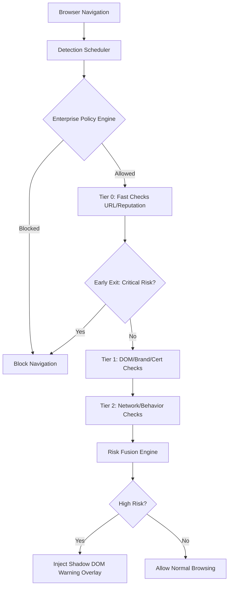

# IPX — Intelligent Internet Phishing Extension

Privacy-first, real-time phishing and malicious website detection for modern browsers.

IPX is a modular, offline-first browser security extension designed to detect phishing, scam, and suspicious websites in real time. Built exclusively on client-side technologies, IPX analyzes web traffic, domain structures, and DOM behaviors locally, protecting users before harm occurs without transmitting sensitive browsing data to external servers.

---

## Design Philosophy

IPX adheres to a strict set of architectural and operational principles:

* **Privacy-First Protection:** Analyze locally. Warn intelligently. Protect before harm.
* **Local Execution:** Heuristics and logic run entirely within the browser.
* **Low Latency:** Tiered execution, asynchronous operations, debouncing, and aggressive caching ensure minimal impact on page load times.
* **Explainable Risk Assessment:** Risk scores are calculated based on transparent, inspectable heuristics.
* **Manifest V3 Compliant:** Strict adherence to modern extension security models (event-driven Service Workers, CSP).
* **Modular Architecture:** Extensible Plugin Registry separating URL analysis, form detection, and behavioral heuristics into independent, priority-tiered execution layers.

---

## Architecture

IPX employs a highly optimized layered detection architecture, evaluating threats both prior to network navigation and post-page load using a `DetectionScheduler` to aggressively save memory and CPU cycles.

### Threat Detection Flow

### 1. Smart Early-Exit Detection Scheduler
The `DetectionScheduler` replaces traditional synchronous execution by organizing detectors into tiers based on priority and performance cost. 
* **Tier 0:** Lightweight URL parsing and reputation cache lookups.
* **Tier 1:** Certificate validation, Brand Impersonation, and DOM node structural parsing.
* **Tier 2:** Behavioral analysis and Network leakage checks.
If any tier definitively classifies the page as a critical threat, the engine exits early, immediately blocking the page to save processing cycles.

### 2. Event-Driven MV3 Service Worker
Background execution is entirely event-driven. The extension relies on `onBeforeNavigate` and `onMessage` listeners. Aggressive memory monitoring ensures that if V8 heap usage exceeds 150MB, an emergency `cleanup()` broadcast is executed across all plugins to prevent the browser from terminating the extension.

### 3. Lightweight Targeted Extraction
`content-script.js` avoids expensive global DOM transversals. It utilizes a surgical, debounced `MutationObserver` paired with `WeakSet` caching to only extract newly added `FORM`, `IFRAME`, and `A` nodes, reducing layout thrashing and freezing.

### 4. Multi-Layer Caching
Calculations are cached through a `GlobalCache` implementing specific, isolated LRU silos with independent Time-To-Live (TTL) values:
* **URLCache:** 30-minute TTL
* **DomainCache:** 1-hour TTL
* **ResultCache:** 5-minute TTL

---

## Features & Detection Modules (Implemented)

IPX includes 9 independent plugin detectors orchestrated by the `PluginRegistry`:

* **URLDetector:** Detects typosquatting, homographs, Punycode tricks, and suspicious TLDs using fast-path Levenshtein optimizations.
* **FormDetector:** Identifies credential harvesting, off-screen hidden inputs, and unauthorized data collection.
* **DOMDetector:** Analyzes structural elements for clickjacking overlays, zero-pixel iframes, and obfuscated scripts.
* **BehaviorDetector:** Monitors hostile page interactions like clipboard hijacking, right-click disabling, and auto-submits.
* **BrandImpersonationDetector:** Evaluates Levenshtein distances against target known enterprise brands.
* **CertificateAnalyzer:** Validates SSL/TLS transport security and scheme usage.
* **DomainIntelligence:** Evaluates offline domain metadata and ASN characteristics.
* **NetworkAnalyzer:** Detects mixed content and cross-origin leakage.
* **ReputationEngine:** Consults offline blocklists and specific threat intelligence signatures.

---

## Risk Scoring & Fusion (Implemented)

The `RiskFusionEngine` calculates a 0–100 risk score based on aggregated findings. It applies base confidence weights, priority multipliers, and severity caps to prevent false negative score dilution.

| Risk Score | Threat Level | Response |
| :--- | :--- | :--- |
| **0 – 19** | Safe | Normal browsing |
| **20 – 39** | Low | Silent tracking |
| **40 – 59** | Medium | Passive indicator |
| **60 – 79** | High | Shadow DOM Warning Overlay |
| **80 – 100**| Critical | Pre-navigation Block / Standalone Warning Page |

The `ExplainableAIEngine` translates fused scores into human-readable evidence-backed findings and recommendations.

---

## Machine Learning Integration (Planned / Stubs Implemented)

**Note:** IPX currently utilizes classical heuristics and does not execute active Machine Learning weights.

Structural stubs and architectural foundations are implemented via the `MLAdapter`. Future phases will inject `.tflite` or ONNX web models into these slots. The `RiskFusionEngine` is already wired to accept, weight, and fuse `URLModel`, `DOMModel`, and `NLPModel` inferences into the final risk assessment.

---

## Project Structure

* `manifest.json`: Chrome Manifest V3 configuration.
* `src/background/service-worker.js`: Event-driven background orchestrator.
* `src/content/content-script.js`: MutationObserver-driven surgical DOM extractor and Shadow DOM overlay manager.
* `src/core/`: Contains the `DetectionScheduler`, `RiskFusionEngine`, `ExplainableAIEngine`, and `EnterprisePolicyEngine`.
* `src/detectors/`: Contains the 9 modular security detector plugins.
* `src/plugins/`: Contains the `PluginRegistry` and `DetectorInterface` contract.
* `src/cache/`: Contains the `MultiLayerCache` and isolated cache silos.
* `src/adapters/`: Contains the `ChromeStorageAdapter` and `MLAdapter` stubs.
* `src/ui/`: Contains the extension popup UI, warning pages, and configuration dashboards.
* `src/utils/`: Cryptographic, Entropy, Punycode, and logging helper functions.

---

## Installation

### Google Chrome / Microsoft Edge / Brave
1. Clone or download this repository.
2. Open your browser's extensions page (`chrome://extensions/` or `edge://extensions/`).
3. Enable **Developer mode** in the top right corner.
4. Click **Load unpacked**.
5. Select the IPX project directory.
6. The IPX icon will appear in your toolbar.
