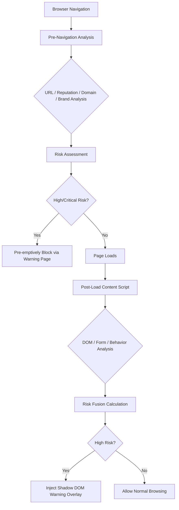
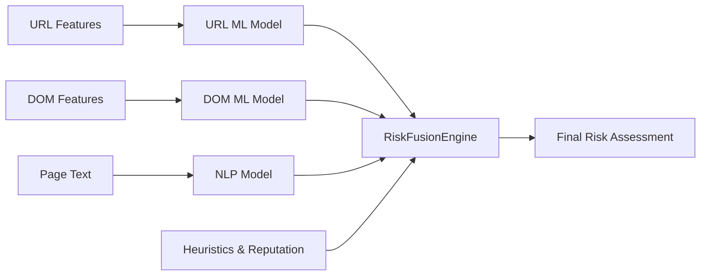

# IPX

## Intelligent Internet Phishing Extension

Privacy-first, real-time phishing and malicious website detection for modern browsers.

IPX is a modular, offline-first browser security extension designed to detect phishing, scam, and suspicious websites in real time. Built exclusively on client-side technologies, IPX analyzes web traffic, domain structures, and DOM behaviors locally, protecting users before harm occurs without transmitting sensitive browsing data to external servers.

---

## Design Philosophy

IPX adheres to a strict set of architectural and operational principles:

* **Privacy-First Protection:** Analyze locally. Warn intelligently. Protect before harm.
* **Local Execution:** Heuristics and logic run entirely within the browser.
* **Low Latency:** Asynchronous operations, debouncing, and aggressive caching ensure minimal impact on page load times.
* **Explainable Risk Assessment:** Risk scores are calculated based on transparent, inspectable heuristics.
* **Manifest V3 Compliant:** Strict adherence to modern extension security models (Service Workers, CSP, no `eval()`).
* **Modular Architecture:** Extensible design separating URL analysis, form detection, and behavioral heuristics.

---

## Architecture

IPX employs a layered detection architecture, evaluating threats both prior to network navigation and post-page load.

### Threat Detection Flow

---

## Features & Detection Modules

### 1. URL Analysis (Implemented)
Operates at the pre-navigation layer to detect malicious structural patterns.
* Unicode normalization and Punycode decoding.
* Homograph and typosquatting detection using keyboard proximity matrices.
* Levenshtein distance calculations against targeted brands.
* Detection of character substitutions, raw IP hostnames, and suspicious TLDs.
* Identification of excessive subdomains and URL shorteners.

### 2. Form Detection (Implemented)
Identifies credential harvesting and sensitive-data collection attempts.
* Detection of password fields on non-HTTPS connections.
* External form action monitoring.
* Identification of SSN, credit card, and government ID request fields.
* Context-aware scoring based on the surrounding DOM environment.

### 3. DOM / Content Analysis (Implemented)
Analyzes structural page elements post-load using `MutationObserver`.
* Hidden zero-pixel iframe detection.
* Misleading display link texts.
* Obfuscated JavaScript indicators.
* Detection of urgency-inducing language common in social engineering.

### 4. Behavior Analysis (Implemented)
Monitors hostile or suspicious page interactions.
* Auto-submitting forms.
* Unauthorized clipboard read/write activity.
* Popup window spamming.
* Right-click context menu restrictions.

### 5. Risk Scoring & Fusion (Implemented)
The `RiskFusionEngine` calculates a 0–100 risk score based on aggregated findings.

| Risk Score | Threat Level | Response |
| :--- | :--- | :--- |
| **0 – 19** | Safe | Normal browsing |
| **20 – 39** | Low | Silent tracking |
| **40 – 59** | Medium | Passive indicator |
| **60 – 79** | High | Shadow DOM Warning Overlay |
| **80 – 100**| Critical | Pre-navigation Block / Standalone Warning Page |

---

## User Interfaces

IPX provides three distinct UI surfaces for user interaction and protection.

1. **Popup:** Provides quick security status, a breakdown of the current page's risk score, active threat findings, and a mechanism to force a site re-scan.
2. **Warning Page:** A standalone, pre-navigation blocking page. Presents the user with the calculated risk level, detected findings, and an option to bypass the warning if deemed a false positive.
3. **Warning Overlay:** An in-page UI injected post-load when high-risk DOM/Behavior elements are detected. Rendered within an isolated Shadow DOM to prevent malicious scripts from tampering with the warning.

---

## Caching and Performance

To maintain low latency, IPX utilizes:
* A bounded LRU cache (1000 item capacity).
* Time-to-Live (TTL) invalidation (30 minutes).
* Memoization of expensive string-distance calculations.
* Debounced `MutationObserver` implementations.
* Throttled DOM traversal.

---

## Privacy & Security Model

IPX is designed for zero telemetry by default. The core extension utilizes vanilla web technologies and enforces strict internal security boundaries:
* **Manifest V3 Constraints:** Enforced Service Worker lifecycles and strict CSP.
* **Shadow DOM Isolation:** Protects warning overlays from page-context CSS/JS interference.
* **Safe DOM Construction:** Explicit prevention of `eval()` and strict input/output sanitization.
* **Client-Side Processing:** All heuristics execute entirely within the local browser runtime.

---

## Machine Learning Roadmap (Planned)

**Note:** IPX does not currently contain active Machine Learning models. 

Future phases will introduce a pluggable ML architecture allowing users or enterprise administrators to supply and integrate custom models.

---

## Project Status

| Component                 | Status      |
| ------------------------- | ----------- |
| Manifest V3 Core          | Implemented |
| URL Analysis              | Implemented |
| Form Detection            | Implemented |
| DOM Analysis              | Implemented |
| Behavior Analysis         | Implemented |
| Risk Scoring              | Implemented |
| Pre-Navigation Protection | Implemented |
| Post-Load Protection      | Implemented |
| Shadow DOM Overlay        | Implemented |
| Caching                   | Implemented |
| Popup                     | Implemented |
| Warning Page              | Implemented |
| ML Models                 | Planned     |
| ML Integration            | Planned     |
| Advanced Reputation       | Planned     |
| Visual Analysis           | Planned     |
| OCR                       | Planned     |

---

## Development Roadmap

* **Phase 1:** Core heuristic engine (Current)
* **Phase 2:** Advanced intelligence modules (Domain/Certificate/Network/Brand analysis)
* **Phase 3:** Machine Learning integration (URL/DOM/NLP model adapters)
* **Phase 4:** Advanced browser intelligence (Visual similarity & OCR)
* **Phase 5:** Enterprise capabilities (Policy engine, threat intelligence integrations)

---

## Project Structure

* `manifest.json`: Chrome Manifest V3 configuration.
* `background.js`: Service worker handling pre-navigation interception and orchestration.
* `content.js`: Content script injected into pages for DOM monitoring and overlay rendering.
* `phishing-detector.js`: Core heuristics engine containing URL, form, DOM, and behavioral analyzers.
* `config.js`: Immutable configuration rules and thresholds.
* `cache-manager.js`: Performance optimization layer implementing LRU and TTL strategies.
* `utils.js`: Helper functions including cryptographic routines and string algorithms.
* `popup.html` / `popup.js`: Extension popup UI.
* `warning.html` / `warning.js`: Standalone pre-navigation blocking page.
* `styles.css`: Base extension styles.
* `warning-overlay.css`: Isolated styles for the Shadow DOM warning component.

---

## Installation

### Google Chrome / Microsoft Edge / Brave
1. Clone or download this repository.
2. Open your browser's extensions page (`chrome://extensions/` or `edge://extensions/`).
3. Enable **Developer mode** in the top corner.
4. Click **Load unpacked**.
5. Select the IPX project directory.
6. The IPX icon will appear in your toolbar.

---

## Testing Scenarios

To verify IPX functionality, you may use the following safe, controlled scenarios:
1. Navigate to a raw IP address (e.g., `http://192.168.1.1/login`).
2. Visit a URL containing excessive subdomains or a highly suspicious TLD.
3. Construct a local HTML file containing a password input field hosted on an insecure `http://` or `file://` context.
4. Construct a local HTML file featuring an invisible iframe (`opacity: 0` or `width: 0`).

*Note: IPX heuristics may correctly identify these as low/medium risks individually. A combination of factors is required to trigger a high-risk block.*
